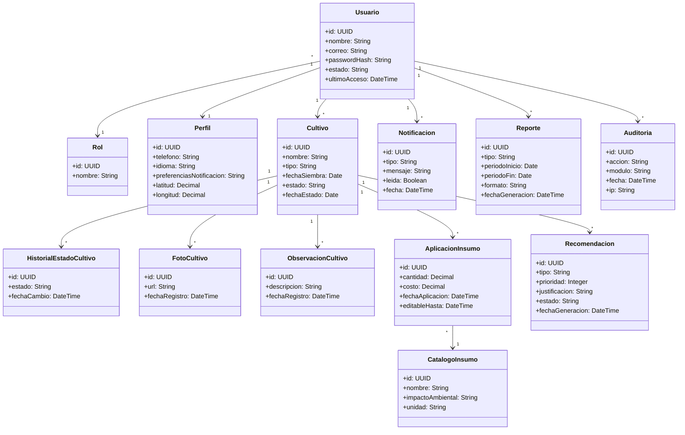
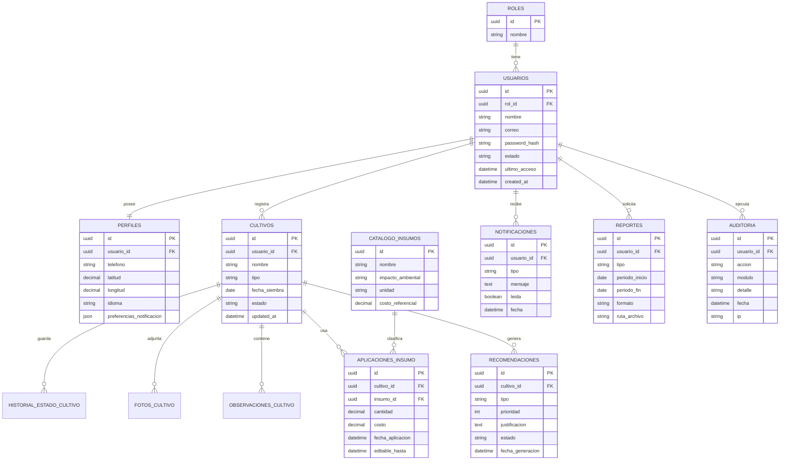
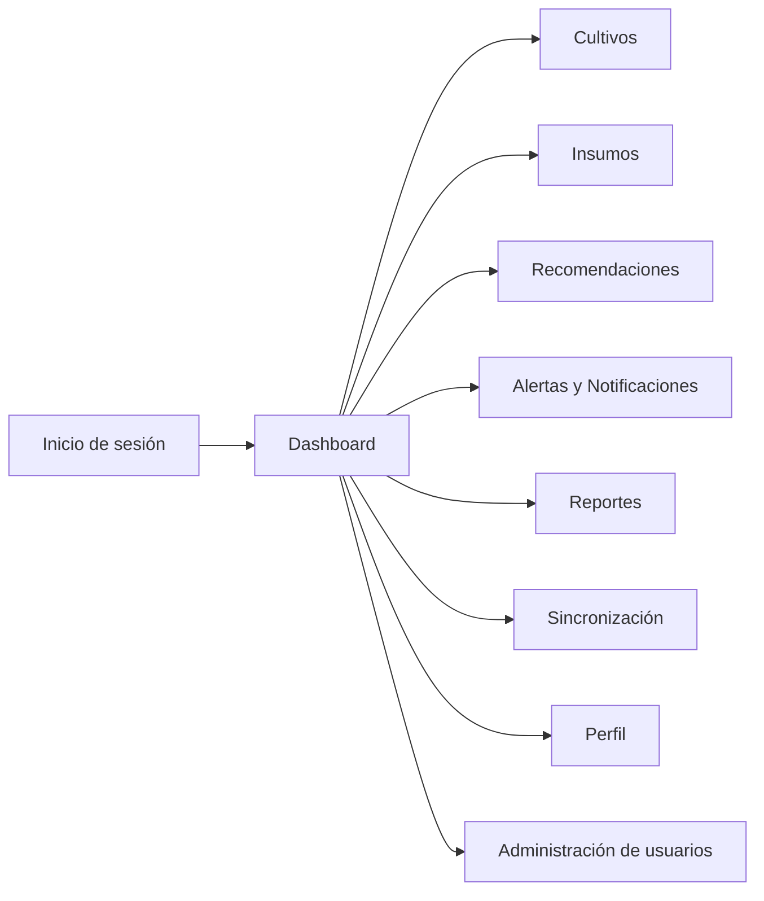
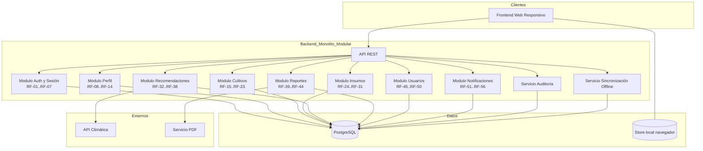
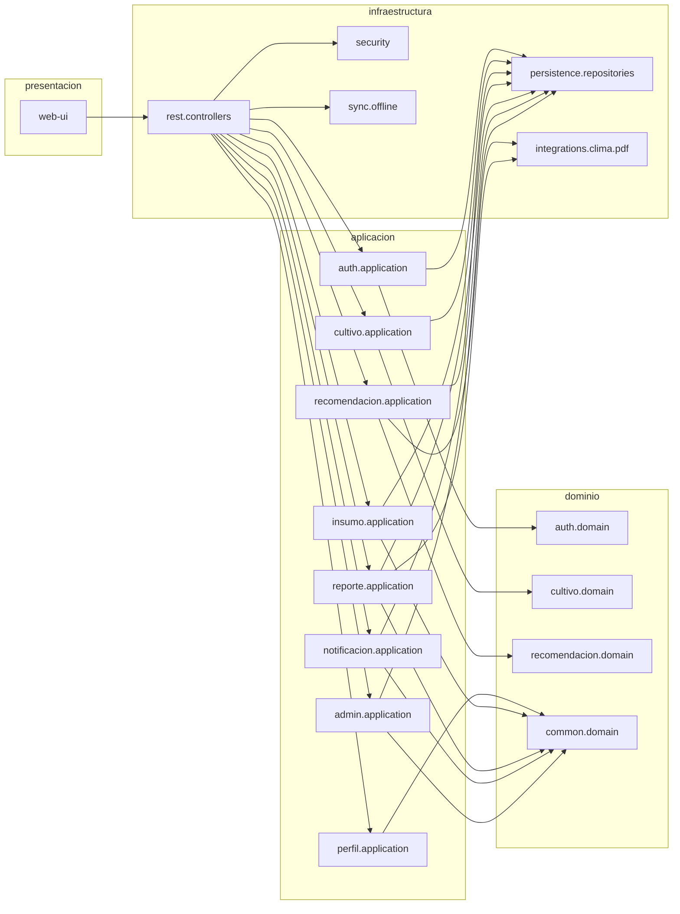
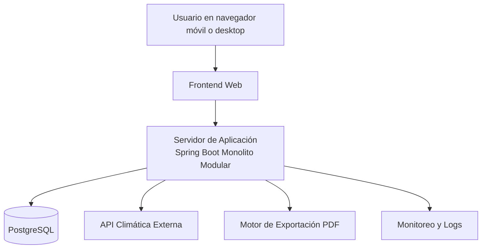

# Entregable 3 - Documento de Diseño Arquitectónico Final

## Título del proyecto

Plataforma Digital de Agricultura Inteligente para Pequeños Productores del Magdalena

---

## 1. Ajustes de Casos de Uso Nivel 0 y Nivel 1

Esta sección consolida las correcciones realizadas para que los casos de uso sean consistentes con los RF finales y con la arquitectura seleccionada.

### 1.1. Ajustes aplicados en Nivel 0

- Se unificó el alcance funcional en 6 macrocasos: autenticación y perfil, cultivos, insumos, recomendaciones, reportes y administración de usuarios.
- Se mantuvieron actores principales del dominio: Productor Agrícola, Operario de Campo, Administrador y Asociación Agrícola.
- Se reforzó la trazabilidad con RF agrupados por módulo:
	- Gestión de acceso y perfil: RF-01 a RF-14.
	- Gestión de cultivos: RF-15 a RF-23.
	- Gestión de insumos: RF-24 a RF-31.
	- Recomendaciones y alertas: RF-32 a RF-38 y RF-51 a RF-56.
	- Reportes: RF-39 a RF-44.
	- Gestión de usuarios: RF-45 a RF-50.

### 1.2. Ajustes aplicados en Nivel 1

- En Gestionar Cultivos se ajustaron relaciones include y extend para reflejar validaciones, cambios de estado, observaciones y fotos.
- En Gestionar Usuarios se corrigió la cobertura de alta, edición, desactivación, reactivación, roles/permisos y actividad reciente.
- Se dejó explícita la relación de acciones destructivas con confirmación previa, coherente con RNF-32.

### 1.3. Correcciones de alcance funcional por caso de uso

| Caso de uso Nivel 1 | RF cubiertos | Ajuste clave |
|---|---|---|
| Gestionar Cultivos | RF-15 a RF-23 | Se añade filtro, detalle, historial y registro de estado |
| Gestionar Insumos | RF-24 a RF-31 | Se integra cálculo de costo y alerta ambiental |
| Gestionar Recomendaciones | RF-32 a RF-38 | Se incorpora priorización, justificación y trazabilidad |
| Gestionar Reportes | RF-39 a RF-44 | Se refuerza filtrado temporal y exportación PDF |
| Gestionar Usuarios | RF-45 a RF-50 | Se formalizan estados de cuenta y permisos |
| Gestionar Notificaciones | RF-51 a RF-56 | Se alinea con sincronización offline |

---

## 2. Listado de RF ya finales

### REQUERIMIENTOS FUNCIONALES (RF)

RF-01: El sistema debe permitir la autenticación de usuarios mediante usuario y contraseña antes de acceder a cualquier funcionalidad.

RF-02: El sistema debe permitir cerrar la sesión de forma segura desde cualquier pantalla.

RF-03: El sistema debe permitir recuperar la contraseña mediante un código de verificación enviado al correo registrado.

RF-04: El sistema debe permitir cambiar la contraseña ingresando la contraseña actual y confirmando la nueva.

RF-05: El sistema debe bloquear temporalmente una cuenta después de múltiples intentos fallidos de inicio de sesión.

RF-06: El sistema debe gestionar roles y permisos para restringir el acceso a funcionalidades.

RF-07: El sistema debe mantener la sesión activa por un tiempo limitado y solicitar reautenticación al expirar.

RF-08: El sistema debe permitir crear y completar el perfil con información personal y productiva.

RF-09: El sistema debe mostrar toda la información del perfil en una sola pantalla.

RF-10: El sistema debe permitir editar la información del perfil, excepto el correo electrónico.

RF-11: El sistema debe permitir cargar una foto de perfil en formatos permitidos.

RF-12: El sistema debe permitir registrar la ubicación geográfica mediante coordenadas o mapa.

RF-13: El sistema debe permitir configurar el idioma de la interfaz.

RF-14: El sistema debe permitir configurar las preferencias de notificación.

RF-15: El sistema debe permitir registrar un cultivo con sus datos principales.

RF-16: El sistema debe mostrar la lista de cultivos activos ordenados por fecha.

RF-17: El sistema debe mostrar el detalle completo de un cultivo.

RF-18: El sistema debe permitir editar un cultivo mientras no esté finalizado.

RF-19: El sistema debe permitir actualizar el estado de un cultivo registrando la fecha del cambio.

RF-20: El sistema debe permitir eliminar un cultivo solicitando confirmación y conservando el historial.

RF-21: El sistema debe permitir adjuntar múltiples fotografías a un cultivo.

RF-22: El sistema debe permitir registrar observaciones asociadas a un cultivo.

RF-23: El sistema debe permitir buscar y filtrar cultivos por diferentes criterios.

RF-24: El sistema debe permitir registrar la aplicación de un insumo a un cultivo.

RF-25: El sistema debe mostrar el historial de insumos aplicados a un cultivo.

RF-26: El sistema debe permitir editar un registro de insumo dentro de un tiempo limitado.

RF-27: El sistema debe permitir eliminar un registro de insumo con confirmación.

RF-28: El sistema debe calcular el costo total de insumos por cultivo.

RF-29: El sistema debe generar alertas cuando se registre un insumo de alto impacto ambiental.

RF-30: El sistema debe gestionar un catálogo de insumos disponible para consulta.

RF-31: El sistema debe generar recomendaciones de insumos según condiciones del cultivo.

RF-32: El sistema debe generar recomendaciones de fertilización según el ciclo del cultivo.

RF-33: El sistema debe generar recomendaciones fitosanitarias.

RF-34: El sistema debe mostrar las recomendaciones activas ordenadas por prioridad.

RF-35: El sistema debe mostrar el detalle y justificación de cada recomendación.

RF-36: El sistema debe permitir marcar recomendaciones como atendidas.

RF-37: El sistema debe permitir descartar recomendaciones manteniendo el historial.

RF-38: El sistema debe mostrar el historial de recomendaciones.

RF-39: El sistema debe generar reportes del estado de los cultivos.

RF-40: El sistema debe generar reportes de consumo de insumos.

RF-41: El sistema debe generar reportes de alertas recibidas.

RF-42: El sistema debe permitir exportar reportes en formato PDF.

RF-43: El sistema debe permitir filtrar reportes por período de tiempo.

RF-44: El sistema debe generar reportes comparativos entre cultivos.

RF-45: El sistema debe permitir crear cuentas de usuario con datos básicos y rol asignado.

RF-46: El sistema debe mostrar la lista de usuarios registrados.

RF-47: El sistema debe permitir editar la información de los usuarios.

RF-48: El sistema debe permitir desactivar cuentas sin eliminar datos.

RF-49: El sistema debe permitir reactivar cuentas desactivadas.

RF-50: El sistema debe mostrar la actividad reciente de los usuarios.

RF-51: El sistema debe enviar notificaciones internas de alertas climáticas.

RF-52: El sistema debe enviar notificaciones internas de nuevas recomendaciones.

RF-53: El sistema debe mostrar un contador de notificaciones no leídas.

RF-54: El sistema debe sincronizar notificaciones generadas en modo offline.

RF-55: El sistema debe mostrar el historial de notificaciones.

RF-56: El sistema debe permitir eliminar notificaciones.

---

## 3. Estilo arquitectónico elegido y justificación

### 3.1. Estilo elegido

Se selecciona explícitamente una arquitectura Cliente-Servidor en Capas con Monolito Modular en backend.

- Capa de Presentación: Frontend web responsivo.
- Capa de Aplicación: API REST y casos de uso.
- Capa de Dominio: reglas del negocio agrícola.
- Capa de Persistencia: repositorios y acceso a datos.
- Infraestructura de datos: PostgreSQL + caché local del navegador para modo offline.

### 3.2. Por qué responde mejor a restricciones económicas

- Menor costo de operación frente a microservicios distribuidos.
- Despliegue simple en infraestructura de bajo costo.
- Menor gasto en observabilidad, orquestación y mantenimiento operativo.
- Ajuste al presupuesto objetivo mensual del proyecto.

### 3.3. Por qué responde mejor a restricciones técnicas (conectividad)

- Soporte offline-first en frontend para registrar datos sin conexión.
- Cola de sincronización al recuperar conectividad.
- Menor número de puntos de fallo de red comparado con soluciones altamente distribuidas.
- Experiencia de uso estable en entornos de señal intermitente.

### 3.4. Por qué responde mejor a atributos de calidad prioritarios

- Rendimiento: menos latencia intra-sistema al centralizar lógica crítica.
- Mantenibilidad: separación clara de responsabilidades por capas.
- Seguridad: control unificado de autenticación, autorización y auditoría.
- Disponibilidad funcional: continuidad de tareas críticas en modo offline.

### 3.5. Alternativa descartada y motivo

Alternativa descartada: Arquitectura de Microservicios.

Motivos principales:

- Incrementa complejidad para un equipo pequeño y tiempo académico limitado.
- Mayor costo operacional (despliegue, monitoreo, networking y trazas distribuidas).
- Mayor riesgo de fallas de integración en escenarios de conectividad inestable.
- Sobredimensionada para el volumen inicial esperado de usuarios y transacciones.

---

## 4. Diseño de datos - Modelo de datos

### 4.1. Diagrama de clases (lógico)

### 4.2. Diagrama de base de datos (físico simplificado)

---

## 5. Diseño de interfaces

### 5.1. Coherencia interfaz-arquitectura

- La interfaz web se organiza por módulos funcionales que reflejan paquetes de la capa de aplicación.
- El estado de conectividad visible en pantalla responde a la estrategia offline-first.
- Flujos de alta frecuencia (cultivos, insumos, alertas) tienen navegación directa y formularios simplificados.

### 5.2. Wireframes y mockups disponibles

- Mockup principal de referencia visual.
- Wireframes por módulo de usuarios, cultivos, insumos y sincronización.
- Wireframe web de baja fidelidad para navegación y contenido operativo.

### 5.3. Navegación principal

---

## 6. Diseño arquitectónico

### 6.1. Análisis de RF hacia arquitectura (diagrama de bloques)

### 6.2. Componentes de la arquitectura (diagrama de paquetes)

### 6.3. Despliegue (diagrama de despliegue)

---

## 7. Registro de Decisiones Arquitectónicas (ADR)

### 7.1. ADR-01 Selección de metodología de desarrollo

- Decisión: RUP iterativo con entregas quincenales.
- Motivo: ajuste a equipo pequeño, planificación formal y trazabilidad documental.
- Impacto: facilita control del avance y revisión temprana por docentes y stakeholders.

### 7.2. ADR-02 Selección de estilo arquitectónico

- Decisión: Cliente-servidor por capas con monolito modular.
- Motivo: balance entre simplicidad, costo, mantenibilidad y tiempos del curso.
- Impacto: reduce complejidad operativa y mejora la velocidad de implementación.

### 7.3. ADR-03 Elección del tipo de base de datos

- Decisión: Base de datos relacional PostgreSQL.
- Motivo: integridad referencial para entidades altamente relacionadas y consultas analíticas.
- Impacto: facilita trazabilidad y consistencia de datos para reportes y auditoría.

### 7.4. ADR-04 Estrategia de manejo de conectividad

- Decisión: Offline-first con sincronización eventual y resolución de conflictos.
- Motivo: conectividad intermitente en zonas rurales del Magdalena.
- Impacto: continuidad operativa en registro de cultivos, insumos y notificaciones.

---

## 8. Evidencias de trabajo en equipo

### 8.1. ¿Cómo se reunieron?

- Reuniones de planificación semanal para priorización y seguimiento.
- Reuniones cortas de avance para bloquear riesgos técnicos.
- Sesiones de revisión de entregables antes de cada corte académico.

### 8.2. ¿Cómo trabajaron?

- Distribución por roles: arquitectura, requisitos, datos, desarrollo, validación.
- Trabajo colaborativo sobre documentos compartidos por módulos.
- Integración progresiva de artefactos: requerimientos, diagramas, wireframes y ADR.

### 8.3. Organización de documentos y evidencias

- Estructura organizada por carpetas: requerimientos, arquitectura, diagramas y mockups.
- Trazabilidad entre RF, RNF, casos de uso, diseño de datos e interfaces.
- Versionamiento incremental por entregables del curso.

### 8.4. Evidencias recomendadas para anexar en presentación

- Capturas de reuniones de trabajo del equipo.
- Registro de acuerdos y tareas por sesión.
- Capturas de avances en diagramas y wireframes.
- Historial de actualizaciones de documentos del proyecto.

---

## 9. Conclusiones

1. La arquitectura Cliente-Servidor en Capas con Monolito Modular es la opción más adecuada para el contexto del proyecto, al equilibrar costo, tiempo y calidad.

2. El diseño propuesto satisface los RF finales y responde a restricciones críticas de conectividad y presupuesto, con una estrategia offline-first que preserva continuidad operativa.

3. El modelo de datos relacional y la separación por componentes soportan seguridad, trazabilidad y mantenibilidad, permitiendo evolución controlada futura hacia esquemas más distribuidos.

4. La coherencia entre arquitectura, casos de uso, diseño de interfaces y decisiones ADR fortalece la calidad del entregable y su viabilidad de implementación.

5. El trabajo colaborativo del equipo, organizado por artefactos y roles, permitió consolidar un diseño técnico sólido y alineado con el alcance académico del curso.

